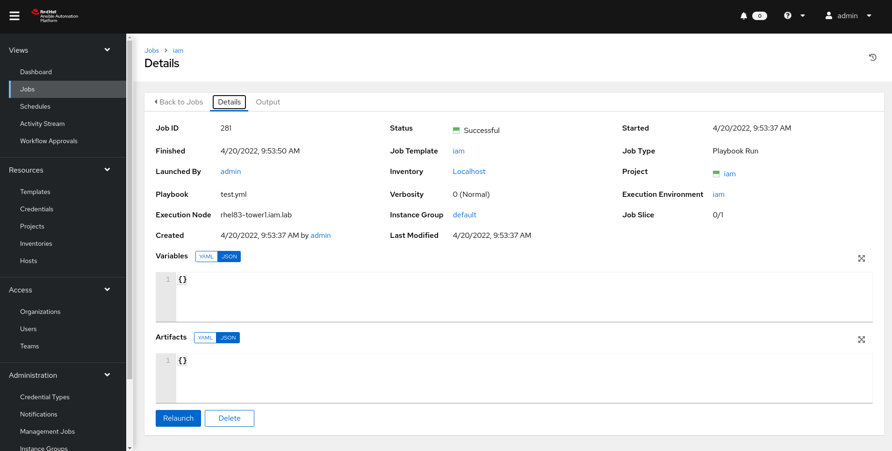
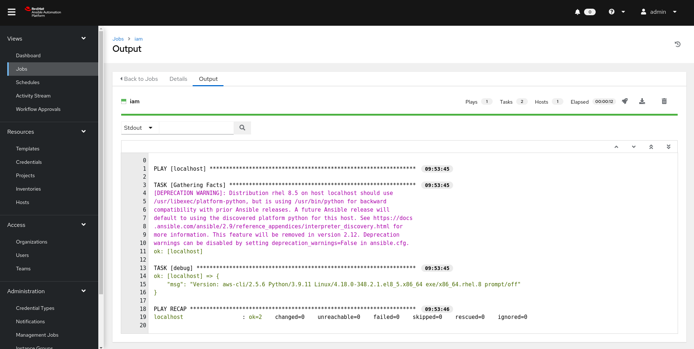

# venv2ee
Migrate (as is) an existing Python Virtual Environment to Execution Environment.

# Virtual Environment Migration tool
The purpose of this repo is to show a procedure to migrate an existing Python Virtual Environment to a new Execution Environment that can be used by Ansible Automation Platform.

In fact, the real reason for this is that a Virtual Environment can contain more things other than just python/pip packages, so they can't be migrated in a direct way.

## Example Virtual Environment
To provide a complete example, a script, which is creating a new Virtual Environment and is installing the `awscli v2` client into it, is provided.

```
# ./1.create_venv.sh 
New python executable in /root/workdir/venvtoeetest/awscliv2/bin/python
Installing setuptools, pip, wheel...done.
--2022-04-20 10:01:47--  https://awscli.amazonaws.com/awscli-exe-linux-x86_64.zip
Resolving awscli.amazonaws.com (awscli.amazonaws.com)... 52.85.151.6, 52.85.151.113, 52.85.151.46, ...
Connecting to awscli.amazonaws.com (awscli.amazonaws.com)|52.85.151.6|:443... connected.
HTTP request sent, awaiting response... 200 OK
Length: 46919245 (45M) [application/zip]
Saving to: ‘awscli-exe-linux-x86_64.zip’

100%[====================================================================================================================================================================================================>] 46,919,245  13.0MB/s   in 3.8s   

2022-04-20 10:01:51 (11.7 MB/s) - ‘awscli-exe-linux-x86_64.zip’ saved [46919245/46919245]

You can now run: /root/workdir/venvtoeetest/awscliv2/bin/aws --version
aws is /root/workdir/venvtoeetest/awscliv2/bin/aws
aws-cli/2.5.6 Python/3.9.11 Linux/3.10.0-1160.45.1.el7.x86_64 exe/x86_64.rhel.7 prompt/off
```

## Adapt the Virtual Environment to be 100% relocatable
A Virtual Environment is created in the path `/path/to/the/venv`, and it can't be moved/copied into any other path, so it should stop working. So, an existing Virtual Environment must be modified to be 100% relocatable, and and script for this is already provided:

```
# ./2.adapt_venv.sh
Making script /root/workdir/venvtoeetest/awscliv2/bin/easy_install relative
Making script /root/workdir/venvtoeetest/awscliv2/bin/easy_install-2.7 relative
Making script /root/workdir/venvtoeetest/awscliv2/bin/pip relative
Making script /root/workdir/venvtoeetest/awscliv2/bin/pip2 relative
Making script /root/workdir/venvtoeetest/awscliv2/bin/pip2.7 relative
Making script /root/workdir/venvtoeetest/awscliv2/bin/wheel relative
Making script /root/workdir/venvtoeetest/awscliv2/bin/python-config relative
```

## Build the new Execution Environment
The output of the last script is a `tar.gz` file containing the full Virtual Environment. This `tar.gz` file can be added to a new Execution Environment, and it can be used directly with a minimum tunning. Another script is provided to build the new Execution Environment and publish it to a private Ansible Automation Hub:

```
# ./3.create_ee.sh rhel83-toweri.iam.lab admin ansible-execution-env:1.0
Type the admin's password to push the image to rhel83-toweri.iam.lab: Running command:
  podman build -f context/Containerfile -t rhel83-toweri.iam.lab/ansible-execution-env:1.0 context
Complete! The build context can be found at: /root/workdir/context
Login Succeeded!
Getting image source signatures
Copying blob 6b9eb06eda6e done  
Copying blob b7e6255f061b done  
Copying blob 485a40410daf skipped: already exists  
Copying blob 60609ec85f86 skipped: already exists  
Copying blob f2c4302f03b8 skipped: already exists  
Copying blob 7c371d3a5131 skipped: already exists  
Copying blob a8f52610183c done  
Copying blob 252b3f63769e done  
Copying blob 0b243fbbf3e7 done  
Copying blob e7a15343d56c done  
Copying config 63dbcbf031 done  
Writing manifest to image destination
Storing signatures
```

## Use the new Execution Environment
Now, the new Execution Environment can be used from an Ansible Automation Platorm:






The playbook executed is the following one:

```yaml
---
- hosts: localhost
  connection: local
  tasks:
    - debug:
        msg: "Version: {{ lookup('pipe', 'aws --version') }}"
...
```